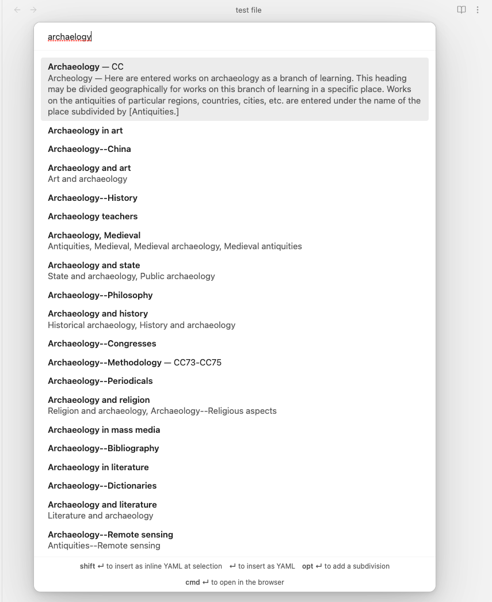
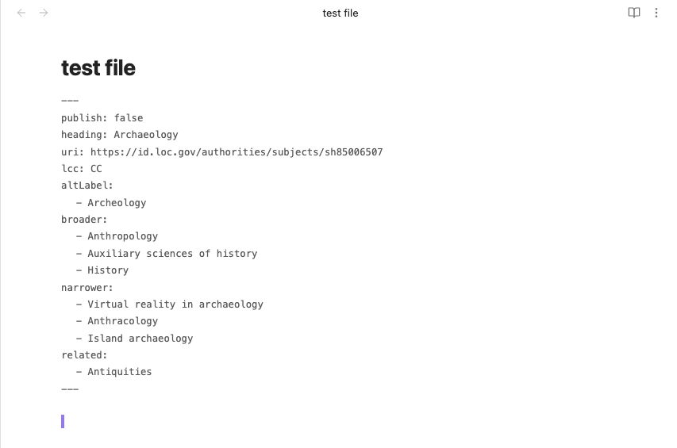

# Obsidian Linked Data Vocabularies Plugin 

> [!important]
> 
> If you are an existing user (version number < 1.0.0), you will need to update your data. For that you need to update the Linked Data Helper plugin to version 1.0.0 and follow the steps outlined in its settings again.

> [!note]
>
> Why should you use this plugin?
> 
> It allows you to add linked data to your notes.
> See [@brimwats](https://github.com/brimwats)’ [explanation](#explanation-of-linked-data) to understand linked data better. 

Currently, Library of Congress Subject Headings are supported.

This plugin adds YAML keys for the selected heading, url (optional), and broader, narrower and related headings. It also supports inserting it as inline YAML at the current selection for use with [Dataview](https://github.com/blacksmithgu/obsidian-dataview).

**To generate the necessary data, you have to install the [Linked Data Helper](https://github.com/kometenstaub/linked-data-helper) plugin.** To sync the data using Obsidian Sync, you will have to enable `Sync all other types` in the Sync settings.

## Configuration

**You need to input the folder in your vault where the JSON files are stored.**

You can set the limit of queries to be displayed. 100 is the default setting. You can also set the fuzzy search sensitivity.

You can set the key names for `heading`, `altLabel`, `uri`, `lcc`,  `broader`, `narrower` and `related` in the settings.

`lcc` is the LC Classification.

All but `heading` can be disabled in the settings.

> [!note]
> 
> There is also an option to load the LCSH Suggester data on startup of Obsidian. This can improve performance on slower devices. It is disabled by default. 
> 
> This is not recommended for mobile devices, because it will slow down every startup, which may happen more frequently.

## Usage

In the editor, open the command palette and execute the `LCSH` command. Alternatively, you can set a hotkey for it.

There are two options: You can either use <kbd>Enter</kbd> to insert the data as YAML.

If there is no YAML block present, a new one will be created. If there is already YAML present, the new YAML will be appended to the current YAML.

Or you use <kbd>Shift</kbd> + <kbd>Enter</kbd> to insert it as inline YAML at the current selection.

By clicking <kbd>Ctrl</kbd>/<kbd>Cmd</kbd> + <kbd>Enter</kbd>, you can open the heading on the Library of Congress website.

You can also add a subdivision after an authorized heading if you press <kbd>Alt</kbd> + <kbd>Enter</kbd>.
[Here](#subdivisions--complex-subjects) is an explanation of Subdivisions from [@brimwats](https://github.com/brimwats).

You can of course also use the mouse instead.

> [!warning]
>
> Inserting the YAML will overwrite existing key values or remove old key names which aren't used by the new heading. This is useful if you want to associate another heading with a note.
> 
> Therefore, make sure to decide on the key names you want to use from the beginning, otherwise the plugin will not be able to overwrite existing keys.
> 
> Also make sure not to use the same YAML keys for other data, as this plugin will overwrite them.

## Modal

The Modal shows the heading in bold, under it, if existing, it shows the variant label and the note.

Next to the heading it shows, if existing, the LC Classification.

## Recommendation

Use this plugin with [Breadcrumbs](https://github.com/SkepticMystic/breadcrumbs). You can set the hierachies in its settings and will have a breadcrumbs view for navigating the heading hierarchy you create in your notes.

# Explanation of linked data

Thank you [@brimwats](https://github.com/brimwats) for this explanation of Linked Data!

This plugin allows the use of structured linked data vocabularies as metadata in Obsidian notes. There are some concepts that should be understood when using this plugin. 

See another explanation [here](https://www.librarianshipstudies.com/2017/03/vocabulary-control.html?m=1) and [here](https://www.ala.org/alcts/resources/z687/skos).

---

When a cultural heritage institution like a library receives a new item, there are several steps that must be taken before it is made available. Most importantly, the item must be **cataloged** with **subject headings**. A **subject heading** is a term that is meant to serve as a keyword or topic explanation for the book. If you have ever used tags or keywords, you understand the purpose. **Cataloging** means that an item is given at least one a subject heading such as "Poodle" or (more often) multiple headings such as "1. Dogs" and "2. Poodles." 

While this might seem obvious when we speak of a “Poodle” or a “Labrador retriever” it gets vastly more confusing when trying to organize thousands or hundreds of thousands of items. And large institutions do this sort of thing everyday, so they have to be **positive** that all headings mean the same thing. Should a “labradoodle” (the offspring of a Labrador and a poodle) be considered a poodle or a Labrador for purposes of classification? What about a “Goldendoodle” (a golden retriever and a poodle)? How about a “Yorkipoo”? A “Pugapoo”? What about a “Cockapoo”, a “Maltipoo” or a “Poo-Shi”?  

Enter controlled vocabularies and information retrieval thesauri.

When most people think of thesauri they likely think of style thesauri, which includes websites like [Thesaurus.com](https://www.thesaurus.com/), or a books like _Rogets Thesaurus,_ which offer similar or dissimilar alternatives to a word or phrase. For the word “Information” Thesaurus.com offers synonyms “advice”, “clue”, or “data”, and antonyms “ignorance”, “question”, “silence”.

There are three basic rules that occur in thesauri are UF, BT/NT and RT.

1.  Use/Use For (USE/UF),
2.  Broader Terms and Narrower Terms (BT/NT), and
3.  Related Terms (RT).

### USE/UF

According to the Library of Congress:
> USE references are made from an unauthorized or non-preferred term to an authorized or preferred heading. Under the heading referred to, the code UF (Used For) precedes the term not used… USE references are made from an unauthorized or non-preferred term to an authorized or preferred heading. Under the heading referred to, the code UF (Used For) precedes the term not used. The codes USE and UF function as reciprocals

This is the strictest of all the rules in a thesaurus. It tells the cataloger to use one word in place of another (USE FOR), or that the material that they are looking for is under a different term (USE).

For example:

**Cars (Automobiles)**
→ USE Automobile

**Automobiles**
→ UF Cars (Automobiles)

USE references are made from synonyms, variant spellings, variant forms of expression, alternate constructions of headings, and earlier forms of headings. USE references are also made when it has been decided that words should not be used as a heading even if the heading and the unused words are not truly synonymous.

### Broader Term and Narrower Term

The abbreviations **BT** (broader term) and **NT** (narrower term) indicate hiararchy.

The code **BT** refers to the class of which the heading is a member. So Automobiles is a broader term for Volvos. Dogs is a broader term for Poodles.

The code **NT** refers a member of the class represented by the heading under which the **NT** appears. So Volvos are a narrower term of Automobiles. Poodles are a narrower term of Dogs.

The broadest (parent) terms tend to be incredibly vague ideas, like “Art”, which then generally need to be narrowed down more to be useful, so it will have muliple **NT**s, or narrower terms, such as

**Art**
→ **NT** Western Art
→ **NT** Indigenous Art
→ **NT** Asian Art
→ [etc.]

These **NT**s will often have further **NT**s, so 
Art
- **NT** Western Art 
    - **NT** Western Sculpture 
        - **NT** Modern Sculpture 
            - **NT** [etc.]

### Related Terms
The abbreviation **RT** (Related Term), links two headings that are associated in some manner other than by hierarchy (**BT**s/**NT**s). For example,

Birds
→ **RT** Ornithology

Ornithology
→ **RT** Birds

In the most basic sense, **RT**s just assert that there are connections between the current subject term and another one. For a cataloger, this enables them to consider connected terms to catalog their material under. For a user, this allows them to check under both subject headings to ensure that they have reviewed all of the relevant information.

**RT**s allow broader information institutions to control terminology.

## Searching for vocabularies:

- You may search the Library of Congress Subject Headings (LCSH) here: [https://id.loc.gov/authorities/subjects.html](https://id.loc.gov/authorities/subjects.html)

- A repository of vocabularies exists here: https://lov.linkeddata.es/dataset/lov/ 

# Subdivisions / Complex Subjects

For LCSH, this plugin also supports what are called "**[Subdivisions](https://www.loc.gov/aba/publications/FreeSHM/H0180.pdf)**" or **complex subjects**. A subdivision is a way for the cataloger (aka the plugin user, aka you) to be more specific with a generic subject heading. 

For example, if I wanted to catalog my note as dicsussing the Ancient Phonecians and their religion I would use this plugin to add `Phonecians` to my note. This would meet many people's needs. But what if I had a lot of notes about `Phonecians`, if I wanted to distuingish between my notes on "Ancient" and "Regular" `Phonecians`, or if I wanted to distinguish between notes about `Phonecian` *religion* and notes about their *gods*? 

LCSH does not have `Ancient Phonecian Gods` so—enter subdivisions! Subdivisions are 'addon' terms that follow the first. Use this secondary term following the first when a more specific heading does not exist.

First find `Phonecians` and then  press `alt+enter/return` to enter into complex mode, where you could pick `--Religion` *or* `--Ancient`. 

## Kinds of Subdivisions

There are five different kinds of subdivisions
-   [Topic Subdivisions](http://id.loc.gov/authorities/subjects/collection_TopicSubdivisions), which represent actions, attributes, or aspects, of the first term. 
    - For example `Helicopters--Flight testing`; `Drinking water--Aluminum content`; `Mental health--Nutritional aspects`. Topical subdivisions are used as a standard way of expressing concepts, methods, or techniques that are common to several fields.
-   [GenreForm Subdivisions](http://id.loc.gov/authorities/subjects/collection_GenreFormSubdivisions), which indicate what the item **is** rather than what it **is about**. You would use this if you had a specific kind of note.
    - For example, the most frequently used form subdivisions, are `--Bibliography`, `--Juvenile literature`, and `--Periodicals`
-   [Temporal Subdivisions](http://id.loc.gov/authorities/subjects/collection_TemporalSubdivisions), which indicate time periods covered in the contents of the work. These are usually associated with a historical treatment of a topic and are used after the subdivision `--History`, 
    - for example, `Women--History--Nineteenth Century`.
-   [Geographic Subdivisions](http://id.loc.gov/authorities/subjects/collection_GeographicSubdivisions), which indicate the geographic area to which treatment of a topic is limited. They may designate where something is located, or where something is from, depending upon the topic.
    - For example: 
-   [Language Subdivisions](http://id.loc.gov/authorities/subjects/collection_LanguageSubdivisions), which indicate what language the item is in. 
    - For example: `Bees--French Language`.
    - If you click this link though, you'll notice that it is an empty page—this subdivision is being phased out!

## More Info on Subdivisions

If you're interested in reading more, here is documentation from the Library of Congress on [Types and purpose of subdivisions.](https://www.loc.gov/aba/publications/FreeSHM/H1075.pdf)

And here is [another explainer](https://www.librarianshipstudies.com/2018/01/library-of-congress-subject-headings-lcsh.html#:~:text=are%20free-floating.-,SUBDIVISIONS,are%20listed%20in%20LCSH.,-In%20order%20to) of subdivisions.

## Credits

This plugin uses the 'fuzzysort' npm module (https://www.npmjs.com/package/fuzzysort, https://github.com/farzher/fuzzysort). The license file can be found [here](https://github.com/kometenstaub/obsidian-linked-data-vocabularies/blob/main/esbuild.mjs).
